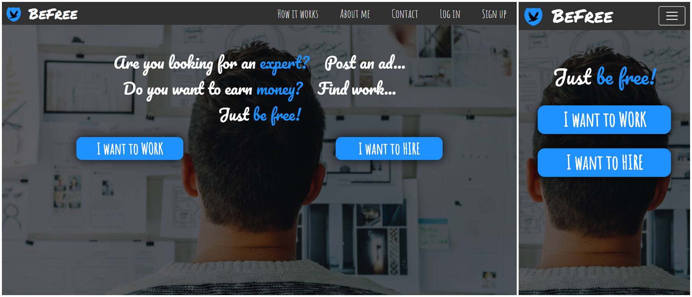
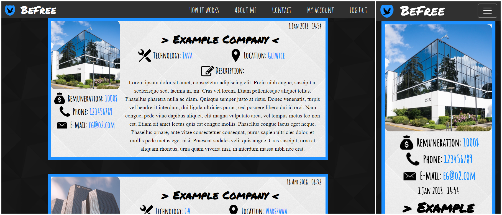
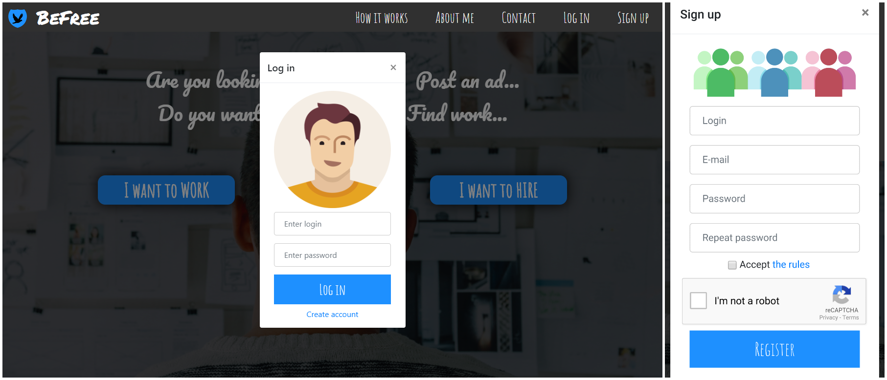

# BeFree
BeFree is a website that will facilitate the work of freelancers. This portal will allow you to easily find an interesting project, with the right level of difficulty and the required technologies. All job announcements will be in one, easily accessible place. Thanks to this, the time needed to find a suitable and satisfactory project for a freelancer will be significantly shortened.

## Demo
### Home Page
 
### Job Offers
 
### Login and Signup
 

## Built With
* [HTML](https://html.spec.whatwg.org/multipage/) - The language for describing the structure of Web pages
* [CSS](https://www.w3.org/Style/CSS/specs.en.html) - The language for describing the presentation of Web pages, including colors, layout, and fonts
* [PHP](https://www.php.net/docs.php) - General-purpose scripting language that is especially suited to web development
* [Bootstrap](https://getbootstrap.com/docs/4.3/getting-started/introduction/) - The web framework used
* [Animate.css](https://github.com/daneden/animate.css/blob/master/README.md) - CSS with a bunch of cool animations
* [MySQL](https://dev.mysql.com/doc/) - Relational database management system

## Authors
* **Tomasz Strzoda** - *Project manager* - [DrDEXT3R](https://github.com/DrDEXT3R)
* **Friend from college** - help when creating version 1.0

## License
This project is licensed under the GNU General Public License v3.0 - see the [LICENSE](https://github.com/DrDEXT3R/BeFree/blob/master/LICENSE) file for details
